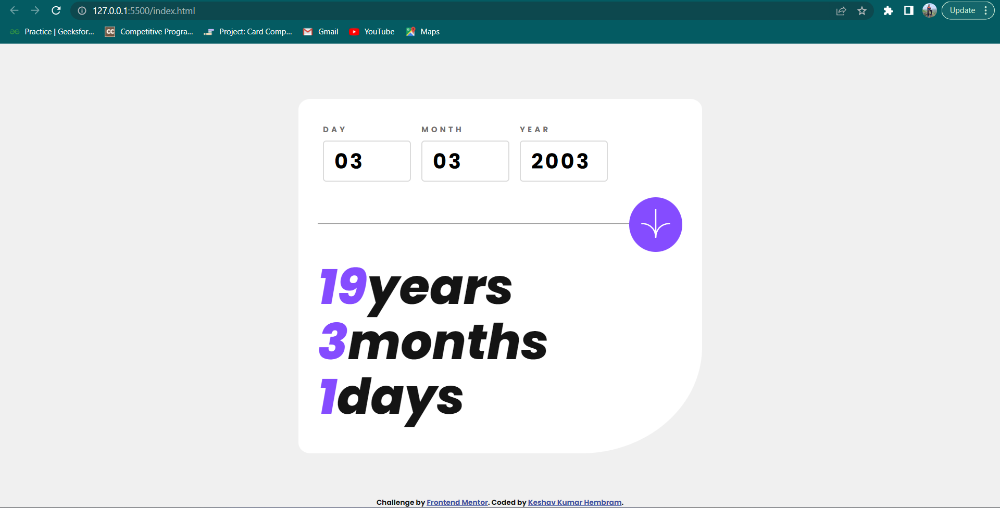

# Frontend Mentor - Age calculator app solution

This is a solution to the [Age calculator app challenge on Frontend Mentor](https://www.frontendmentor.io/challenges/age-calculator-app-dF9DFFpj-Q). Frontend Mentor challenges help you improve your coding skills by building realistic projects. 

## Table of contents

- [Overview](#overview)
  - [The challenge](#the-challenge)
  - [Screenshot](#screenshot)
  <!-- - [Screen Recording](#screen-recording) -->
  - [Links](#links)
- [My process](#my-process)
  - [Built with](#built-with)
  - [What I learned](#what-i-learned)
  - [Continued development](#continued-development)
- [Author](#author)


## Overview

### The challenge

Users should be able to:

- View an age in years, months, and days after submitting a valid date through the form
- Receive validation errors if:
  - Any field is empty when the form is submitted
  - The day number is not between 1-31
  - The month number is not between 1-12
  - The year is in the future
  - The date is invalid e.g. 31/04/1991 (there are 30 days in April)
- View the optimal layout for the interface depending on their device's screen size
- See hover and focus states for all interactive elements on the page
- **Bonus**: See the age numbers animate to their final number when the form is submitted

### Screenshot



<!-- ### Screen Recording
 -->

### Links

- Solution URL: [Github repo](https://github.com/keshavkumarhembram/age-calculator-app-frontend-mentor)
- Live Site URL: [Age calcultor](https://keshavkumarhembram.github.io/age-calculator-app-frontend-mentor/)

## My process

### Built with

- Semantic HTML5 markup
- CSS custom properties
- Flexbox

### What I learned

1. How to animate one element triggered by other element.
```js
birthDayInput.addEventListener("submit", (event) => {
  event.preventDefault();
  outputAnimation(yearOutput);
  outputAnimation(monthOutput);
  outputAnimation(dayOutput);
});

function outputAnimation (element)  {
  element.classList.add('output-animation');
  setTimeout(() => element.classList.remove('output-animation'), 500);
}
```

2.  Remove arrows/spinner in `input type="number"`
   ```css
   /* Chrome, Safari, Edge, Opera */
input::-webkit-outer-spin-button,
input::-webkit-inner-spin-button {
  -webkit-appearance: none;
  margin: 0;
}

/* Firefox */
input[type=number] {
  -moz-appearance: textfield;
}
```

3. How to use `.ttf` files in css

 ```css
 @font-face {
 font-family: 'name';
 src : url(path/name.ttf);
}
```
 - `.woff` files can also be used


### Continued development

- This was the first time that I have used animation for some event. I would love to try some more of this.


## Author

- Frontend Mentor - [@keshavkumarhembram](https://www.frontendmentor.io/profile/keshavkumarhembram)
- Twitter - [@keshavhembram](https://twitter.com/keshavhembram)


